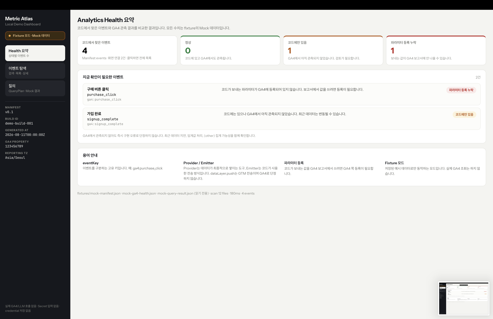

<div align="center">


# Metric Atlas

### See what your frontend tracks — and whether your analytics agree.

Metric Atlas is an open-source analytics observability toolkit for React and Vite applications. It discovers tracking events in existing source code, connects them to real interface elements, and compares the implementation with GA4 data and configuration.

[Repository](https://github.com/Metric-Atlas/Metric-Atlas) · [Documentation](https://github.com/Metric-Atlas/Metric-Atlas/tree/main/docs) · [Contributing](https://github.com/Metric-Atlas/Metric-Atlas/blob/main/CONTRIBUTING.md)


</div>

---

## Analytics instrumentation should not be a guessing game

Tracking knowledge is usually scattered across source code, spreadsheets, dashboards, and the people who remember how everything was wired. As applications evolve, those sources drift apart.

Metric Atlas turns the implementation itself into a living analytics map.

```text
Existing frontend code
        ↓
Event detection and UI binding
        ↓
Live overlay and event manifest
        ↓
GA4 observation and configuration
        ↓
Analytics health, search, and query
```

## What Metric Atlas does

### Explore tracking directly in the product

Open the Metric Atlas overlay and hover a tracked element to see its original event name, emitter, analytics provider, parameters, and source location.

### Compare code with analytics reality

See which events exist in code, which are observed in GA4, which are managed automatically, and which custom parameters are missing Custom Dimension registration.

### Review analytics changes in every pull request

Scan the base and head Git trees to report added or removed events, provider and emitter changes, parameter changes, unresolved bindings, and unsupported patterns.

### Search without rewriting event semantics

Find events by their original names, source locations, providers, and health status. Optional natural-language querying builds on the same verified event catalog.

<p align="center">
  
</p>

<table>
  <tr>
    <td width="50%"></td>
    <td width="50%"></td>
  </tr>
</table>

## Built around clear boundaries

- Your source files stay untouched. DOM metadata is injected only into build output.
- GA4 and GTM remain distinct concepts. A `dataLayer.push(...)` call is a GTM emitter, not automatically a GA4 event.
- Unsupported wrappers, dynamic names, and unresolved bindings become visible warnings instead of silent omissions.
- Analytics result status and data-quality flags remain separate.
- Credentials stay in the Node runtime — never in the browser bundle, manifest, local storage, Git, or logs.
- No database is required.

## Try it locally

Requirements: Node.js 22.18 or later.

```bash
git clone https://github.com/Metric-Atlas/Metric-Atlas.git
cd Metric-Atlas
corepack enable
pnpm install --frozen-lockfile
pnpm demo
```

Open [http://127.0.0.1:5180](http://127.0.0.1:5180).

The local demo runs the detector, manifest, DOM binding, and overlay against real source code. GA4 health and query data use safe fixtures, so no analytics credentials are required.

Run the complete verification suite:

```bash
pnpm verify
```

## Architecture

Metric Atlas is a TypeScript monorepo built around small, explicit boundaries:

- **Detector and Vite plugin** — source analysis, JSX binding, manifest generation, and build-output instrumentation
- **Overlay** — live event metadata inside the application UI
- **GA4 connector and health engine** — observation, managed-event classification, registration gaps, and quality signals
- **Node runtime** — static assets, manifests, analytics APIs, credentials, and in-memory caching
- **Dashboard and query tools** — health exploration, event search, comparisons, and optional natural-language workflows
- **CLI and GitHub Actions** — scans, manifest diffs, and pull-request reports

## Contributing

Metric Atlas is built in the open and welcomes thoughtful issues, discussions, documentation improvements, test cases, and code contributions.

Start with the [Contributing Guide](https://github.com/Metric-Atlas/Metric-Atlas/blob/main/CONTRIBUTING.md), then explore the [project documentation](https://github.com/Metric-Atlas/Metric-Atlas/tree/main/docs) and [source of truth](https://github.com/Metric-Atlas/Metric-Atlas/blob/main/docs/00-project-source-of-truth.md).

<div align="center">

**Make analytics implementation visible, verifiable, and trustworthy.**

</div>
